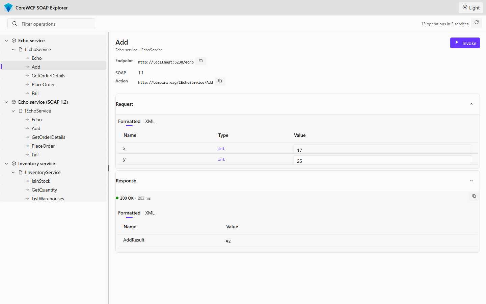
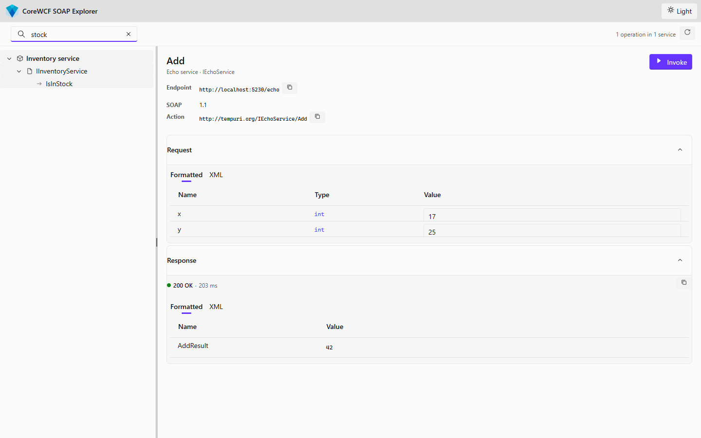
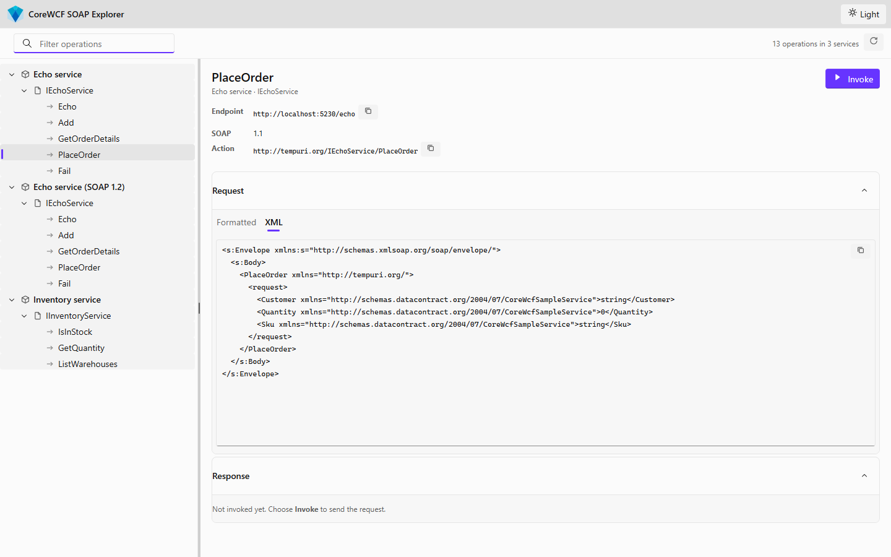
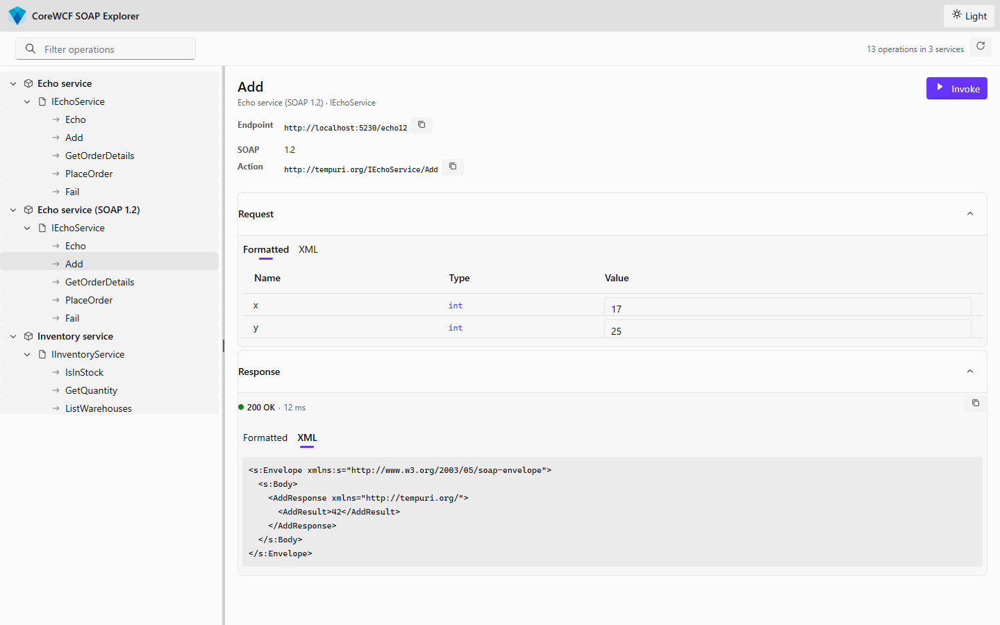
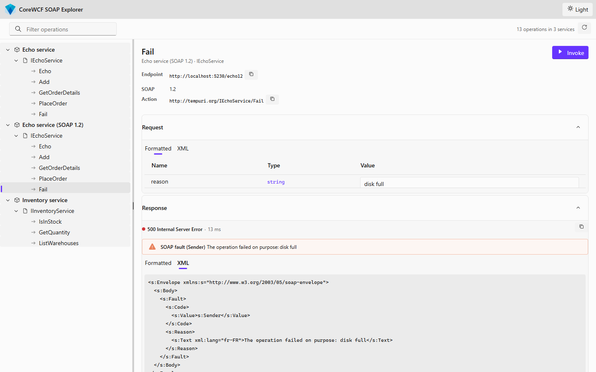
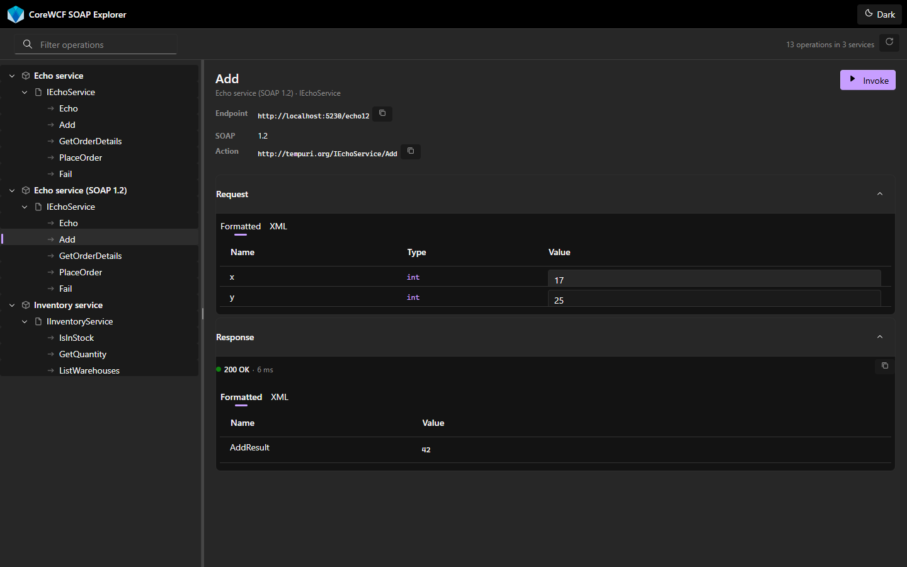
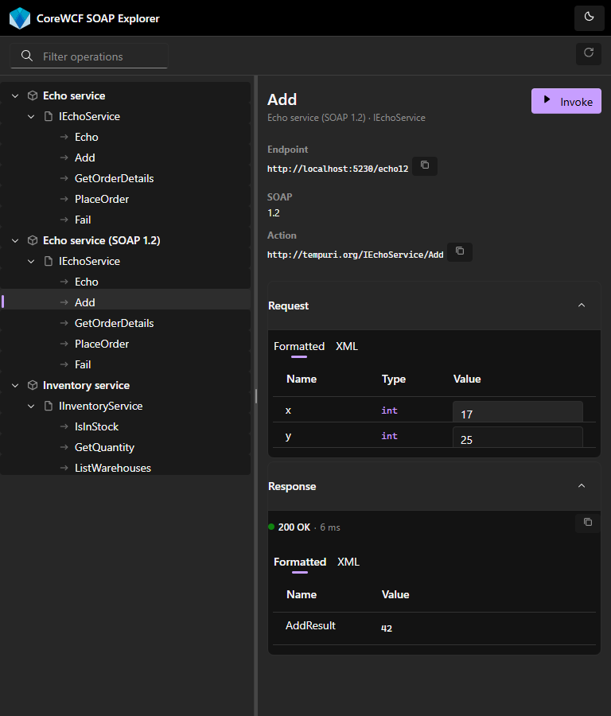

# CoreWCF SOAP Explorer

The SOAP Explorer is a browser UI for calling CoreWCF services while you develop them. It reads a
service's WSDL, lists its contracts and operations, builds a request for you, sends it, and shows
the response — the job the classic *WCF Test Client* did for WCF, without leaving the browser.

It is delivered by the `CoreWCF.Aspire.Hosting` integration and appears as a resource in the
[.NET Aspire](https://aspire.dev) dashboard, so it is wired to your services automatically and
needs no connection details typed in by hand.



---

## Getting there

Register the explorer in your AppHost and point it at the services you want to browse:

```csharp
var echoService = builder.AddProject<Projects.CoreWcfSampleService>("echo-service");

builder.AddCoreWcfExplorer("wcf-explorer")
    .WithCoreWcfService(echoService, metadataPath: "/echo", name: "Echo service")
    .WithCoreWcfService(echoService, metadataPath: "/echo12", name: "Echo service (SOAP 1.2)")
    .WithCoreWcfService(echoService, metadataPath: "/inventory", name: "Inventory service");
```

Run the AppHost, open the Aspire dashboard, and follow the `wcf-explorer` endpoint. Each
`WithCoreWcfService` call becomes one service in the tree. See
[`src/CoreWCF.Aspire.Hosting/README.md`](../../src/CoreWCF.Aspire.Hosting/README.md) for the full
hosting API and the supported Aspire versions.

Each path must be a metadata address of its own. Metadata is published **per service**, not per
endpoint: two endpoints on one service class share a single WSDL document that is only reachable at
the first endpoint's address, so the second one is invisible to any client. The sample hosts its
SOAP 1.2 endpoint on a separate service type for exactly this reason.

---

## Features

### The service tree

Every registered service is read at start-up, so the tree arrives fully populated:
**service → contract → operation**. There is no "click to load" step.

Each row carries an icon that identifies what it is, and every row has an accessible name, so the
tree is usable with a screen reader. It is fully keyboard-operable: <kbd>Tab</kbd> moves into the
tree, the arrow keys walk it, and <kbd>Enter</kbd> opens the focused operation.

Hovering a service reveals a **reload** button that re-fetches just that service's WSDL — useful
when you have changed a contract and rebuilt. The selected operation survives the reload as long as
it still exists. The toolbar's reload button refreshes every service at once.

### Filtering

The filter box narrows the tree as you type, matching service, contract and operation names. A
matching service or contract keeps all of its operations, so searching for a service name does not
also hide the operations inside it. The toolbar shows how much is left.



### Building a request

Operations whose parameters are all simple types get a **Formatted** editor: a Name / Type / Value
grid you fill in directly, exactly like the WCF Test Client.

Values are committed as you type. That matters for the keyboard shortcut below — you can type a
value and invoke immediately, without tabbing out of the field first, and the value you can see is
the value that gets sent.

The **XML** tab always shows the full SOAP envelope, pre-filled with a sample body derived from the
service's schema. Edit it freely; whichever tab is active when you invoke is the one that is sent.
A copy button puts the envelope on the clipboard.

When an operation takes a complex type, the grid cannot express it. The Formatted tab disables
itself and the XML editor takes over, already populated with the data contract's shape:



### Invoking

**Invoke** sends the request; <kbd>Ctrl</kbd>+<kbd>Enter</kbd> does the same from anywhere on the
page. While a call is in flight the button becomes **Cancel**, which aborts it.

The response section reports the HTTP status, the reason phrase and the round-trip time. A coloured
dot — never coloured text — carries the success or failure signal, which keeps the text readable at
full contrast in both themes.

Results are shown two ways. **Formatted** flattens the response body into Name / Value rows;
complex values keep their XML and wrap rather than being clipped. **XML** shows the whole
pretty-printed envelope, with a copy button.

### SOAP versions

Both SOAP 1.1 and 1.2 are supported, and the version is read from the WSDL binding rather than
assumed — it is shown in the metadata row alongside the endpoint and the action. Everything
downstream follows from it: the envelope namespace, how the action reaches the service, and how a
fault is read back.

The sample hosts the same contract twice so the difference is visible side by side. Here the SOAP
1.2 endpoint is selected, and the reply comes back in a `http://www.w3.org/2003/05/soap-envelope`
envelope:



### Faults

A SOAP fault is not just a red status. The fault reason and code are lifted out of the envelope and
shown in their own message bar, and the raw envelope stays available on the XML tab.

The two SOAP versions spell a fault entirely differently — `faultcode`/`faultstring` in 1.1,
`Code`/`Reason` in 1.2 — so the explorer reads them with WCF's own `MessageFault` rather than
guessing at element names. The code is reported as the version in play actually names it, so the
same failure reads `SOAP fault (Client)` against a 1.1 endpoint and `SOAP fault (Sender)` against
a 1.2 one. The sample exposes the same contract over both, so this is easy to see side by side:



### Themes

The header's theme control cycles **System → Light → Dark**. System follows the operating system
setting. The choice is remembered between visits and applied before the first paint, so there is no
flash of the wrong theme on reload.



### Narrower windows

The layout holds its full fidelity down to about 1024px, then degrades: the metadata list stacks
into a single column, the filter narrows, and the operation count and theme label drop away. Down
to 768px nothing is lost and the page never scrolls sideways.



---

## How it works

Two halves, each using the library that fits it.

**Reading the service.** The explorer fetches the flattened WSDL from `?singleWsdl` and reads it with
`System.Web.Services.Description`, the WSDL object model, to get the contracts, their operations,
each operation's SOAP version and action, and the shape of its request. The parameter grid and the
sample envelope are both generated from the schema that comes with it.

> WCF's own metadata importer — `WsdlImporter` and `MetadataExchangeClient` — is not part of the
> .NET client libraries; it stayed behind on .NET Framework, and `dotnet-svcutil` is a design-time
> code generator rather than something callable at runtime. Reading WSDL in a running app therefore
> goes through the WSDL object model.

**Calling the service.** Invocation goes through the WCF client stack, over a
`ChannelFactory<IRequestChannel>`. The channel shape rather than a typed `ChannelFactory<T>`, because
there is no compile-time contract to bind to — the operations came from WSDL read moments earlier.
That leaves WCF in charge of the envelope, the SOAP version and the action header, and means a fault
arrives as a message to be rendered rather than an exception to be caught.

The request is built from the envelope exactly as it stands in the editor, so anything you add by
hand — including headers — is sent as written.

**WS-Addressing is off.** Endpoints that require addressing headers are not supported: turning it on
would break plain `BasicHttpBinding` services, which are what this tool is usually pointed at.

## Notes and limits

- **Transport.** The explorer speaks SOAP 1.1 and 1.2 over HTTP and HTTPS. Services must expose
  metadata (`?singleWsdl`) for the explorer to read them — `ServiceMetadataBehavior.HttpGetEnabled`.
- **No WS-Addressing.** See *How it works* above. Endpoints that require addressing headers, such as
  the default `WSHttpBinding`, will reject the request.
- **No authentication.** Requests are sent as-is, with no credentials attached. It is a development
  tool; do not expose it to an untrusted network.
- **Below 768px is unsupported.** The two-pane layout has no phone form factor.
- **No environment requirement.** The explorer serves its stylesheets in any environment, whether it
  is run from source or from the published container image. `ASPNETCORE_ENVIRONMENT` does not have
  to be set to `Development`.

## Related

| Document | Contents |
| --- | --- |
| [`src/CoreWCF.Aspire.Hosting/README.md`](../../src/CoreWCF.Aspire.Hosting/README.md) | Hosting API, `WithCoreWcfService`, supported Aspire versions |
| [`src/CoreWCF.Aspire.Explorer/uitests`](../../src/CoreWCF.Aspire.Explorer/uitests) | Browser tests covering the features on this page |
| [`Documentation/Walkthrough.md`](../Walkthrough.md) | Getting started with CoreWCF itself |
