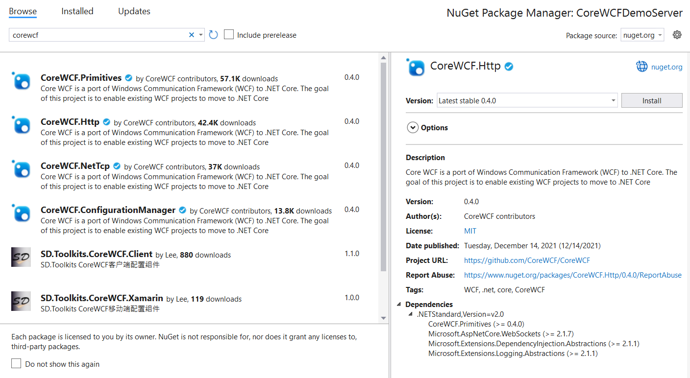

# Getting started

The definition and implementation of data and service contracts is the same as WCF. The major difference is in the definition of the host which is now based on ASP.NET Core, and the ceremony of how a service is exposed. The following is based on .NET 6, but the same steps apply to other versions of .NET.

## Defining the service

### 1. Create an ASP.NET Core Empty application, this provides the host for the service.

*Visual Studio:*
 

*Command Line:*

```cli
mkdir CoreWCFDemoServer
dotnet new web -n CoreWCFDemoServer -o CoreWCFDemoServer
```

### 1. Add references to the CoreWCF Nuget Packages

*Visual Studio:*

Using the package Manager console, add: 

- CoreWCF.Primitives
- CoreWCF.Http



*Command Line:*

Edit the project file and add:

```cli
dotnet add package CoreWCF.Primitives
dotnet add package CoreWCF.Http
```

### 1. Create the Service Contract and Data Contract definitions

These are defined the same as with WCF. When modernizing projects, this code can remain largely unchanged.

**File: IEchoService.cs**

```csharp
using System.Diagnostics.CodeAnalysis;
using System.Runtime.Serialization;
using CoreWCF;

namespace CoreWCfDemoServer
{
    [DataContract]
    public class EchoFault
    {
        [AllowNull]
        private string _text;

        [DataMember]
        [AllowNull]
        public string Text
        {
            get { return _text; }
            set { _text = value; }
        }
    }

    [ServiceContract]
    public interface IEchoService
    {
        [OperationContract]
        string Echo(string text);

        [OperationContract]
        string ComplexEcho(EchoMessage text);

        [OperationContract]
        [FaultContract(typeof(EchoFault))]
        string FailEcho(string text);

    }

    [DataContract]
    public class EchoMessage
    {
        [AllowNull]
        [DataMember]
        public string Text { get; set; }
    }
}

```

**File: EchoService.cs**

```csharp
using CoreWCF;

namespace CoreWCfDemoServer
{
    public class EchoService : IEchoService
    {
        public string Echo(string text)
        {
            System.Console.WriteLine($"Received {text} from client!");
            return text;
        }

        public string ComplexEcho(EchoMessage text)
        {
            System.Console.WriteLine($"Received {text.Text} from client!");
            return text.Text;
        }

        public string FailEcho(string text)
            => throw new FaultException<EchoFault>(new EchoFault() { Text = "WCF Fault OK" }, new FaultReason("FailReason"));

    }
}
```

### 1. The Service host needs to be told which services to expose via which bindings.

Update Program.cs to expose the Bindings:

```csharp
using CoreWCF;
using CoreWCF.Configuration;
using CoreWCF.Description;
using CoreWCfDemoServer;

var builder = WebApplication.CreateBuilder(args);
builder.WebHost.ConfigureKestrel((context, options) =>
{
    options.AllowSynchronousIO = true;
});

// Add WSDL support
builder.Services.AddServiceModelServices().AddServiceModelMetadata();
builder.Services.AddSingleton<IServiceBehavior, UseRequestHeadersForMetadataAddressBehavior>();

var app = builder.Build();
app.UseServiceModel(builder =>
{
    builder.AddService<EchoService>((serviceOptions) => { })
    // Add a BasicHttpBinding at a specific endpoint
    .AddServiceEndpoint<EchoService, IEchoService>(new BasicHttpBinding(), "/EchoService/basichttp")
    // Add a WSHttpBinding with Transport Security for TLS
    .AddServiceEndpoint<EchoService, IEchoService>(new WSHttpBinding(SecurityMode.Transport), "/EchoService/WSHttps");
});

var serviceMetadataBehavior = app.Services.GetRequiredService<CoreWCF.Description.ServiceMetadataBehavior>();
serviceMetadataBehavior.HttpGetEnabled = true;

app.Run();
```

### 1. Update the appsettings.json to specify fixed ports for the service to listen on

Add the following line before the "Logging" line in appsettings.json:

```json
"Urls": "http://localhost:5000;https://localhost:5001",
```

### 1. Run the project so that the services can be called.

## To consume the service.

### 1. Create a console application
### 2. Add a Service Reference

*Visual Studio*

Use the "Add Service Reference" command, and select "WCF Web Service" as the service type.


Use `http://localhost:5000/EchoService/basichttp` as the URL for WSDL discovery.

*Command line*

From the Command Line, the same code can be generated using svcutil:
```cli
dotnet tool install --global dotnet-svcutil
dotnet-svcutil --roll-forward LatestMajor http://localhost:5000/EchoService/basichttp?wsdl
```

### 1. Replace the code of the console app with:
```C#
using ServiceReference1;

// Instantiate the Service wrapper specifying the binding and optionally the Endpoint URL. The BasicHttpBinding could be used instead.
var client = new EchoServiceClient(EchoServiceClient.EndpointConfiguration.WSHttpBinding_IEchoService, "https://localhost:5001/EchoService/WSHttps");

var simpleResult = await client.EchoAsync("Hello");
Console.WriteLine(simpleResult);

var msg = new EchoMessage() { Text = "Hello2" };
var msgResult = await client.ComplexEchoAsync(msg);
Console.WriteLine(msgResult);
```

### Other Samples

Other samples, including samples for desktop framework are available at [CoreWCF/src/Samples](https://github.com/CoreWCF/CoreWCF/tree/main/src/Samples)
